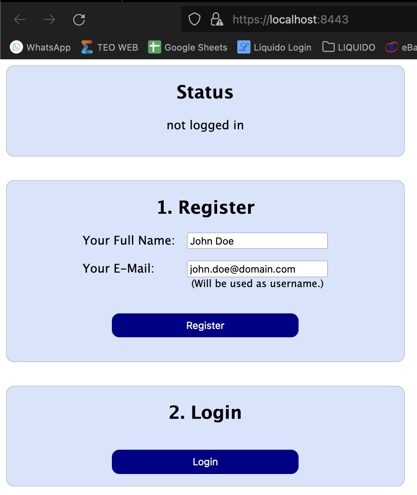

# webauthn-minimal-demo

This is a minimal demo of autheneticating users via fingerprint or Face-ID. 

This demo uses Quarkus with the webauhn-quarkus plugin as the backend and a very simply HTML frontend.

## Preconditions: You need:

### 1. a TLS Certificate **==> IMPORTANT! READ THIS! <==** 

WebAuhn *ONLY* works over an encrypted connection. You *MUST* use SSL/TLS encryption. Your backend and frontend must use HTTPS.

Therefore you need a TLS certificate. You can create a self signed certificate inside a keystore like this:

    keytool -genkeypair -keyalg RSA -keysize 2048 -storetype PKCS12 -keystore ./src/main/resources/quarkus_tls_keystore.p12 -validity 3650
      Choose "password" as the password!
      You can choose any values for firstname, organizational unit, organization, city, state and country-code

Store the .p12 file as `./src/main/resources/quarkus_tls_keystore.p12` and configure your quarkus `application.properties` accordingly.

### 2. and an authenticator (a hardware token, fingerprint or Face-ID) 

The whole idea of 2 factor authentication (2FA) is to have a seconf factor. The first factor normally is your password. Something you know.
But that knowledge could be lost or take by someone else. So we introduce a second factor. Something you, and only you, *own*.
Such a second factor authenticator could for example be a hardware token, an USB stick, a device that displays one time tokens,
your fingerprint or Apple's Face-ID.

You can easily test this in Safari on iPhone or also on a Mac Laptop with fingerprint key sensor.

# Running the application in dev mode

You can run your application in dev mode that enables live coding using:
```shell script
./mvnw compile quarkus:dev
```

This will serve the quarkus application under https://localhost:8443  (secure HTTPS!) 

When you open that URL, then your browser will most likely complain about a non secury TLS certificate. You can safely ignore this warning for this example
and "Accept the risk and continue" (do not do that in the normal Internet! :-) You should then see this webpage:



You can view a lot of debug information in the browsers console. Right click in the browser and choose "Inspect" to open it.

## Register

Before you can login with your fingerprint or Face-ID, you must register your authenticator for the first time. Click the "Register" button.

Safari on Mac for example will now shop a popup dialog telling you to scan your fingerprint.

## Login


## Possible error messages and what to do then


Cannot register. Backend shows error `AttestationException: AAGUID is not 00000000-0000-0000-0000-000000000000!`

=> 


## Related Guides

 - Quarkus Framework - https://quarkus.io/about/
 - Quarkus Security WebAuthn - ([guide](https://quarkus.io/guides/security-webauthn)): Secure your applications with WebAuthn
 - [WebAuthn Guide](https://webauthn.guide/) - very nice basic introduction to WebAuthn
 - 